# Pets Expression Classification Report

## 1. Introduction

This project focuses on classifying pet facial expressions from a diverse dataset of 1000 images. The dataset includes various animals like dogs, cats, rabbits, hamsters, sheep, horses, and birds, displaying expressions such as happiness, sadness, and anger. The goal is to train and evaluate models capable of recognizing these emotions, which can aid in better understanding and improving animal well-being.

We implemented and evaluated several well-known convolutional neural network (CNN) architectures from scratch, and then explored the benefits of transfer learning using pre-trained ImageNet weights for the best-performing model. Data augmentation was utilized during the training process to enhance model generalization.

The implemented models include:
- Visual Geometry Group (VGG16)
- Residual Neural Network (ResNet50)
- MobileNetV1
- Inception V3
- DenseNet121

### Model Architectures

Below are visual representations of some of the architectures implemented or studied:

| VGG16                                 | ResNet50                                     |
| :------------------------------------: | :------------------------------------------: |
|  |  |

| MobileNetV1                                         | DenseNet121                                 |
| :-------------------------------------------------: | :-----------------------------------------: |
|  | 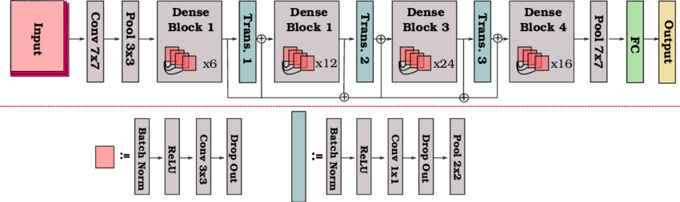 |


### Example Model Implementation (ResNet50)

Here's a snippet from our PyTorch implementation of the ResNet50 model:

```python
# models/ResNet.py (Excerpt)
import torch
import torch.nn as nn

class Bottleneck(nn.Module):
    expansion = 4

    def __init__(self, in_channels, out_channels, stride=1, downsample=None):
        super(Bottleneck, self).__init__()
        self.conv1 = nn.Conv2d(in_channels, out_channels, kernel_size=1, bias=False)
        self.bn1 = nn.BatchNorm2d(out_channels)
        self.conv2 = nn.Conv2d(out_channels, out_channels, kernel_size=3, stride=stride, padding=1, bias=False)
        self.bn2 = nn.BatchNorm2d(out_channels)
        self.conv3 = nn.Conv2d(out_channels, out_channels * self.expansion, kernel_size=1, bias=False)
        self.bn3 = nn.BatchNorm2d(out_channels * self.expansion)
        self.relu = nn.ReLU(inplace=True)
        self.downsample = downsample

    def forward(self, x):
        identity = x

        out = self.conv1(x)
        out = self.bn1(out)
        out = self.relu(out)

        out = self.conv2(out)
        out = self.bn2(out)
        out = self.relu(out)

        out = self.conv3(out)
        out = self.bn3(out)

        if self.downsample is not None:
            identity = self.downsample(x)

        out += identity
        out = self.relu(out)

        return out

class ResNet(nn.Module):
    def __init__(self, block, layers, num_classes=1000): # Modified to accept num_classes
        super(ResNet, self).__init__()
        self.in_channels = 64
        self.conv1 = nn.Conv2d(3, 64, kernel_size=7, stride=2, padding=3, bias=False)
        self.bn1 = nn.BatchNorm2d(64)
        self.relu = nn.ReLU(inplace=True)
        self.maxpool = nn.MaxPool2d(kernel_size=3, stride=2, padding=1)
        
        self.layer1 = self._make_layer(block, 64, layers[0])
        self.layer2 = self._make_layer(block, 128, layers[1], stride=2)
        self.layer3 = self._make_layer(block, 256, layers[2], stride=2)
        self.layer4 = self._make_layer(block, 512, layers[3], stride=2)
        
        self.avgpool = nn.AdaptiveAvgPool2d((1, 1))
        self.fc = nn.Linear(512 * block.expansion, num_classes)

        for m in self.modules():
            if isinstance(m, nn.Conv2d):
                nn.init.kaiming_normal_(m.weight, mode='fan_out', nonlinearity='relu')
            elif isinstance(m, nn.BatchNorm2d):
                nn.init.constant_(m.weight, 1)
                nn.init.constant_(m.bias, 0)

    def _make_layer(self, block, out_channels, blocks, stride=1):
        downsample = None
        if stride != 1 or self.in_channels != out_channels * block.expansion:
            downsample = nn.Sequential(
                nn.Conv2d(self.in_channels, out_channels * block.expansion, kernel_size=1, stride=stride, bias=False),
                nn.BatchNorm2d(out_channels * block.expansion),
            )

        layers = []
        layers.append(block(self.in_channels, out_channels, stride, downsample))
        self.in_channels = out_channels * block.expansion
        for _ in range(1, blocks):
            layers.append(block(self.in_channels, out_channels))

        return nn.Sequential(*layers)

    def forward(self, x):
        x = self.conv1(x)
        x = self.bn1(x)
        x = self.relu(x)
        x = self.maxpool(x)

        x = self.layer1(x)
        x = self.layer2(x)
        x = self.layer3(x)
        x = self.layer4(x)

        x = self.avgpool(x)
        x = torch.flatten(x, 1)
        x = self.fc(x)

        return x

def ResNet50(num_classes=4): # Wrapper function
    return ResNet(Bottleneck, [3, 4, 6, 3], num_classes=num_classes)

# ... (Other ResNet variants like ResNet101, ResNet152) ...
```

---
## 2. Building Well-Known Networks (Training from Scratch)

For this project, we leveraged PyTorch Lightning to streamline the training and validation processes for all our models built from scratch. PyTorch Lightning is a lightweight PyTorch wrapper that organizes your code, reduces boilerplate, and provides a robust framework for training deep learning models. This approach significantly enhanced our development workflow and experimental capabilities.

### Our PyTorch Lightning Workflow

1.  **`PetExpressionClassifier` (LightningModule)**: We defined a `LightningModule` named `PetExpressionClassifier`. This class encapsulates all model-specific logic:
    *   **Initialization (`__init__`)**: Instantiates the chosen base model (e.g., VGG16, ResNet50), defines loss functions (like `F.cross_entropy`), and initializes `torchmetrics` objects for tracking accuracy, precision, recall, and F1-score.
    *   **Forward Pass (`forward`)**: Defines how input data flows through the model.
    *   **Training Step (`training_step`)**: For each batch of training data, it performs a forward pass, calculates the loss, and logs both the training loss and training accuracy using `self.log()`.
    *   **Validation Step (`validation_step`)**: Similar to the training step, but for validation data. It calculates and logs validation loss, accuracy, precision, recall, and F1-score. It also accumulates predictions and targets for generating a confusion matrix at the end of training.
    *   **Optimizer Configuration (`configure_optimizers`)**: Specifies the optimizer to be used (e.g., Adam).
    
    ```python
    class PetExpressionClassifier(LightningModule):
    def __init__(self, model, lr=0.001, num_classes=4):
        super(PetExpressionClassifier, self).__init__()
        self.model = model
        self.lr = lr
        self.num_classes = num_classes

        # metrics
        self.train_accuracy = torchmetrics.Accuracy(task="multiclass", num_classes=self.num_classes)
        self.val_accuracy = torchmetrics.Accuracy(task="multiclass", num_classes=self.num_classes)

        self.val_precision_metric = torchmetrics.Precision(task="multiclass", num_classes=self.num_classes, average="macro")
        self.val_recall_metric = torchmetrics.Recall(task="multiclass", num_classes=self.num_classes, average="macro")
        self.val_f1_metric = torchmetrics.F1Score(task="multiclass", num_classes=self.num_classes, average="macro")

        # For final confusion matrix
        self.all_val_preds = []
        self.all_val_targets = []

    def forward(self, x):
        return self.model(x)
        
    def training_step(self, batch, batch_idx):
        x, y = batch
        y_pred = self(x)
        loss = F.cross_entropy(y_pred, y)
        self.log("train_loss", loss, on_step=True, on_epoch=True, prog_bar=True, logger=True)

        self.train_accuracy(y_pred, y)
        self.log("train_accuracy", self.train_accuracy, on_step=True, on_epoch=True, prog_bar=True, logger=True)

        return loss
    
    def validation_step(self, batch, batch_idx):
        x, y = batch
        y_pred = self(x)
        loss = F.cross_entropy(y_pred, y)
        self.log("val_loss", loss, on_step=True, on_epoch=True, prog_bar=True, logger=True)

        self.val_accuracy(y_pred, y)
        self.log("val_accuracy", self.val_accuracy, on_step=True, on_epoch=True, prog_bar=True, logger=True)

        self.val_precision_metric(y_pred, y)
        self.log("val_precision", self.val_precision_metric, on_step=True, on_epoch=True, prog_bar=True, logger=True)

        self.val_recall_metric(y_pred, y)
        self.log("val_recall", self.val_recall_metric, on_step=True, on_epoch=True, prog_bar=True, logger=True)

        self.val_f1_metric(y_pred, y)
        self.log("val_f1", self.val_f1_metric, on_step=True, on_epoch=True, prog_bar=True, logger=True)

        self.all_val_preds.append(y_pred)
        self.all_val_targets.append(y)

        return loss
    
    def configure_optimizers(self):
        optimizer = optim.Adam(self.parameters(), lr=self.lr)
        return optimizer
    ```

2.  **`Trainer`**: The PyTorch Lightning `Trainer` object handles all the engineering aspects of training:
    *   **Automated Loops**: Manages the training, validation, and test loops, iterating over epochs and batches.
    *   **Hardware Abstraction**: Seamlessly handles device placement (CPU/GPU) based on availability and user arguments (`--gpus`).
    *   **Callbacks**: Integrates a system of callbacks to add custom logic at various stages of training.
    *   **Logging**: Works with specified loggers to save metrics and experiment details.
    ```python
        trainer = Trainer(
        max_epochs=args.max_epochs,
        callbacks=callbacks,
        logger=loggers, # Pass list of loggers
        log_every_n_steps=10,
        accelerator="gpu" if args.gpus > 0 else "cpu",
        devices=args.gpus if args.gpus > 0 else 1,
        num_sanity_val_steps=0
    )
    trainer.fit(classifier, train_loader, val_loader)
    ```

3.  **Callbacks for Enhanced Functionality**: We utilized several built-in and custom callbacks:
    *   **`ModelCheckpoint`**: Automatically saves model checkpoints. We configured it to monitor `val_accuracy` and save the model that achieves the highest validation accuracy (mode="max"), ensuring we always have the best performing version.
    *   **`EarlyStopping`**: Monitors `val_loss` and stops training if the validation loss does not improve for a specified number of epochs (`patience`), preventing overfitting and saving computational resources.
    *   **`LearningRateMonitor`**: Logs the learning rate schedule, useful for debugging and understanding optimizer behavior.
    *   **`TQDMProgressBar`**: Provides a clean and informative progress bar in the terminal or notebook.
    *   **`ReportMetrics` (Custom Callback)**: Our custom callback designed to:
        *   Print formatted validation and training metrics to the terminal after each respective epoch.
        *   Generate and save a final confusion matrix plot and a detailed classification report (precision, recall, F1-score per class) at the end of the entire training process (`on_train_end`).
        *   Plot key metrics (loss, accuracy, F1, etc.) over all epochs from the `metrics.csv` file and save this as an image.

4.  **Loggers for Experiment Tracking**:
    *   **`CSVLogger`**: Saves all metrics logged via `self.log()` into a `metrics.csv` file for each run. This allows for easy offline analysis and plotting.
    *   **`TensorBoardLogger`**: Saves metrics in a format compatible with TensorBoard, enabling interactive visualization of training progress, model graphs, and hyperparameter comparisons.
    *   The `self.log(name, value, on_step=True/False, on_epoch=True, prog_bar=True, logger=True)` method within the `LightningModule` makes it trivial to send any metric to all configured loggers and optionally display it on the progress bar.

### Advantages of Using PyTorch Lightning

*   **Reduced Boilerplate**: We didn't have to write manual training or validation loops, device handling code (`.to(device)`), or explicit gradient zeroing/optimizer stepping/backward pass calls in the main script. The `Trainer` handles this.
*   **Code Organization**: Enforces a clear separation between the model's scientific code (in `LightningModule`) and the engineering/training code.
*   **Reproducibility and Scalability**: Makes experiments easier to reproduce and simplifies scaling to multi-GPU or distributed training environments with minimal code changes.
*   **Flexibility and Iteration**: The modular design allowed us to easily iterate over different model architectures (VGG, ResNet, etc.) by simply changing the model passed to our `PetExpressionClassifier`. Hyperparameters like learning rate, batch size, and number of epochs were managed via command-line arguments, further simplifying experimentation without altering the core training logic.
*   **Integrated Ecosystem**: The seamless integration of callbacks and loggers provided powerful tools for monitoring, saving, and analyzing our experiments with very little extra effort.

Overall, PyTorch Lightning abstracted away much of the repetitive engineering overhead, allowing us to focus more on the model architecture, metric evaluation, and experimental results. The ease of logging comprehensive metrics and managing checkpoints was particularly beneficial for this assignment, where multiple models had to be trained and their results reported systematically.

---

## 3. Building Well-Known Networks (Training from Scratch)
All models were trained from scratch using PyTorch Lightning with data augmentation. The performance metrics (Accuracy, Precision, Recall, F1-score) over epochs and the final confusion matrices are presented below for each model.


All models were trained from scratch using PyTorch with data augmentation. The performance metrics (Accuracy, Precision, Recall, F1-score) over epochs and the final confusion matrices are presented below for each model.

### Visual Geometry Group (VGG16)

**Confusion Matrix (VGG16 - From Scratch):**
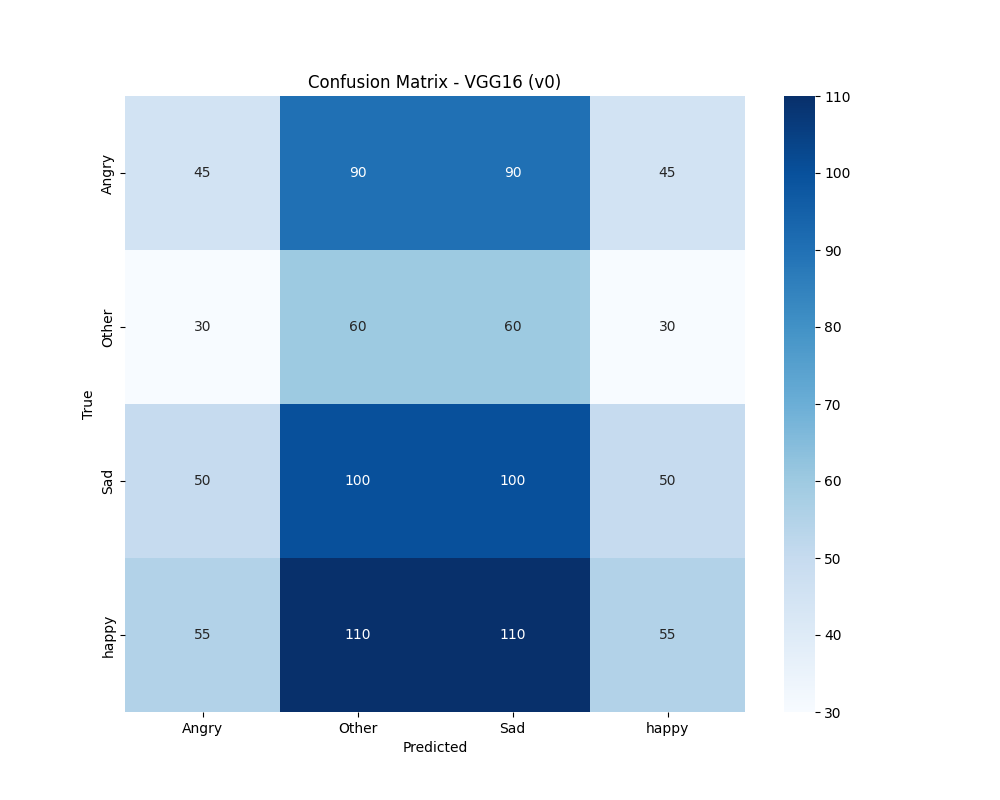

**Metrics Over Epochs (VGG16 - From Scratch):**
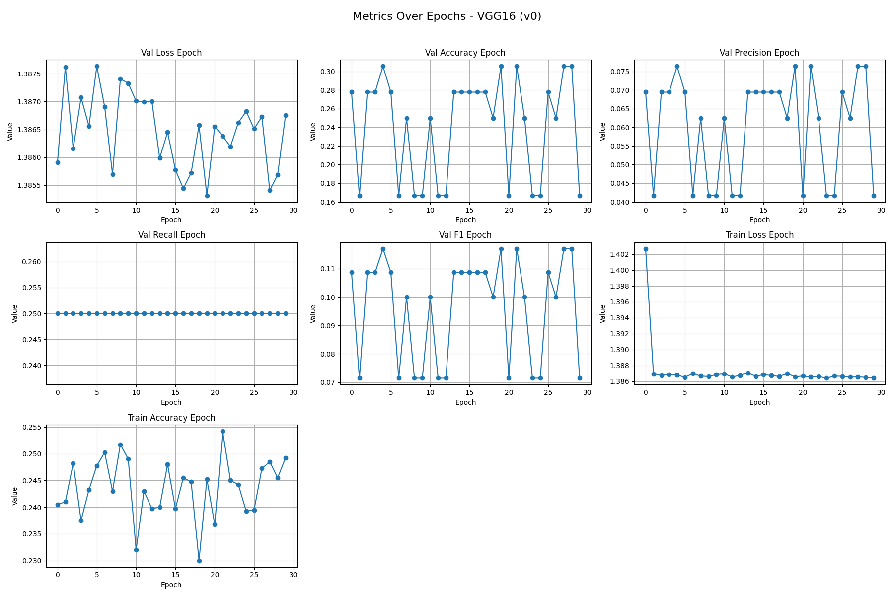

### Residual Neural Network (ResNet50)

**Confusion Matrix (ResNet50 - From Scratch):**
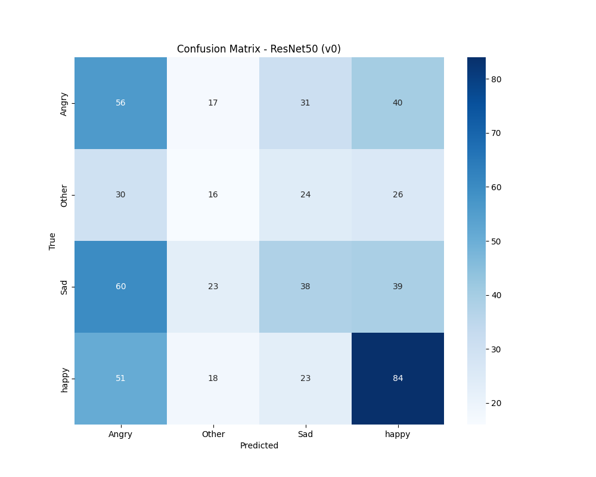

**Metrics Over Epochs (ResNet50 - From Scratch):**
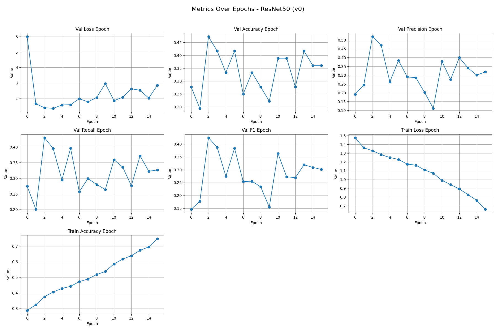

### MobileNetV1

**Confusion Matrix (MobileNetV1 - From Scratch):**
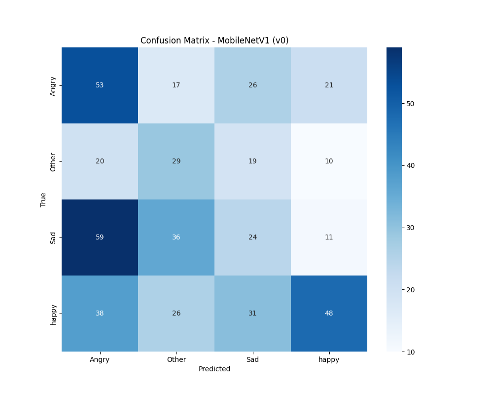

**Metrics Over Epochs (MobileNetV1 - From Scratch):**
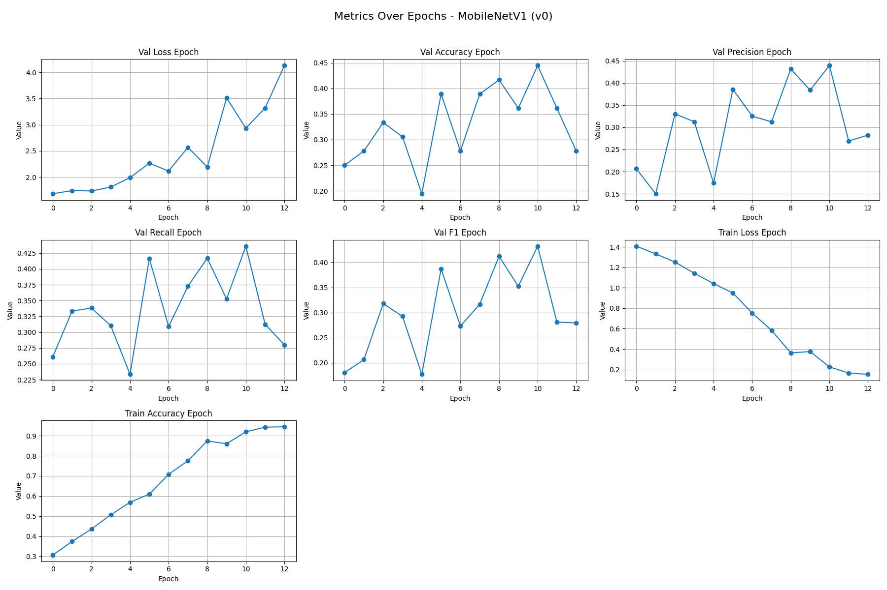

### Inception V3

**Confusion Matrix (InceptionV3 - From Scratch):**
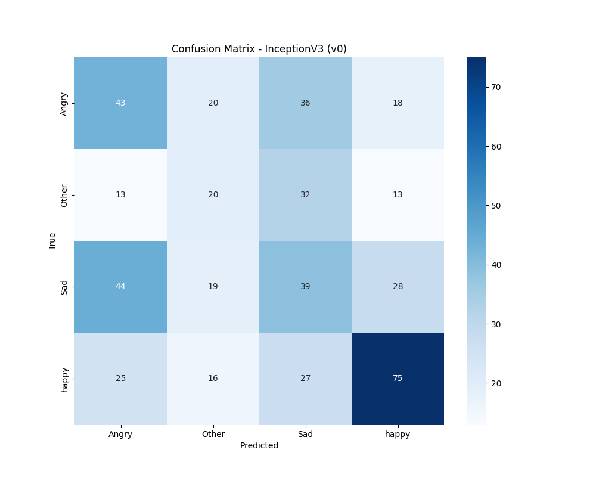

**Metrics Over Epochs (InceptionV3 - From Scratch):**
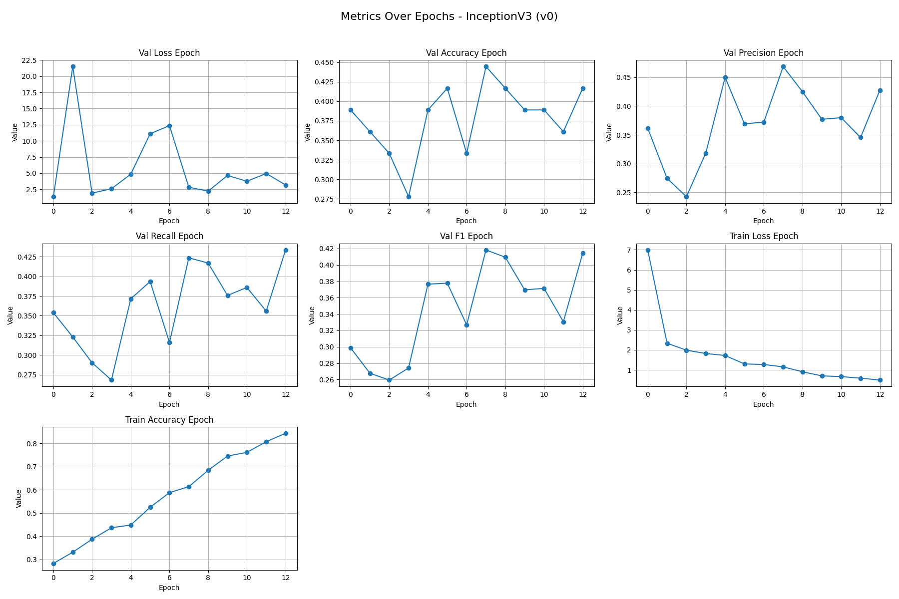

### DenseNet121

**Confusion Matrix (DenseNet121 - From Scratch):**
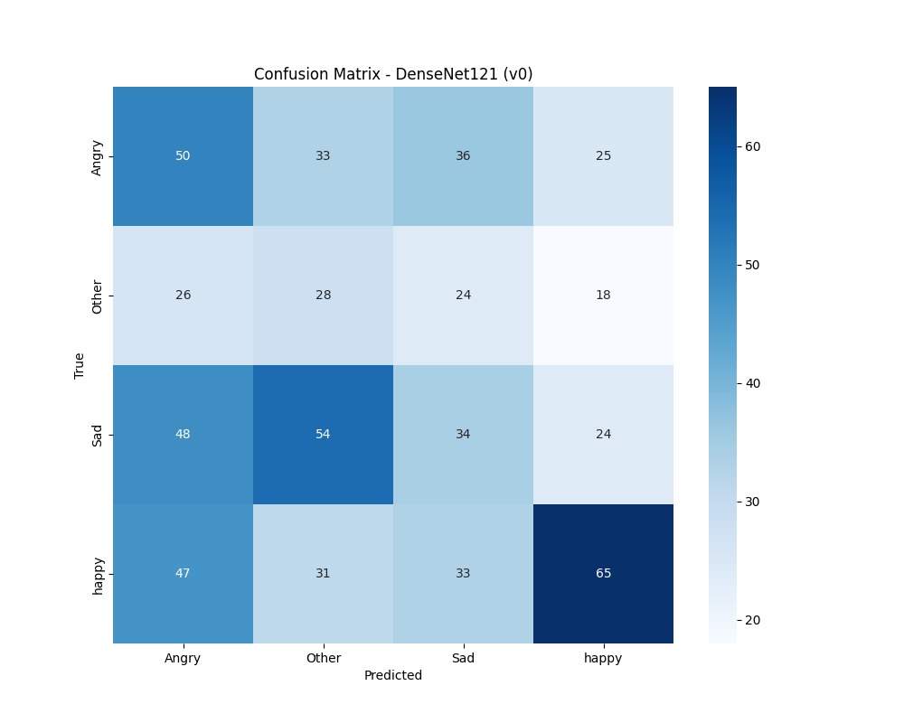

**Metrics Over Epochs (DenseNet121 - From Scratch):**
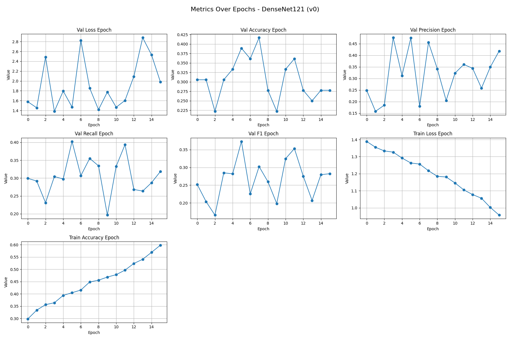

---

## 4. Transfer Learning

From our results training from scratch, ResNet50 and MobileNetV1 showed competitive performance. We selected ResNet50 to apply transfer learning using ImageNet pre-trained weights. The built-in ResNet50 model from PyTorch's `torchvision.models` was used for this part, with its classifier head adapted for our specific number of classes.

### ResNet50 with Transfer Learning

**Training Log:**
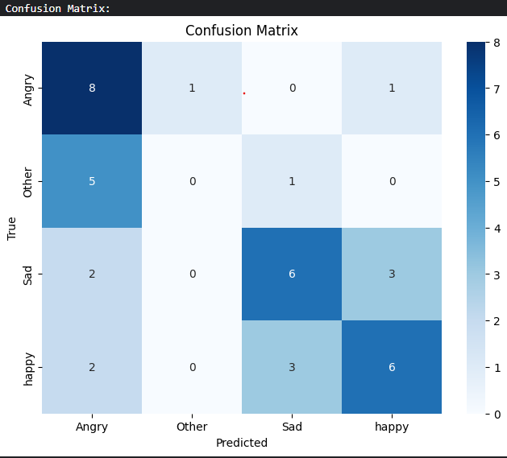

| Class   | Precision | Recall | F1-Score | Support |
|---------|-----------|---------|-----------|----------|
| Angry   | 0.47      | 0.80    | 0.59      | 10       |
| Other   | 0.00      | 0.00    | 0.00      | 6        |
| Sad     | 0.60      | 0.55    | 0.57      | 11       |
| Happy   | 0.60      | 0.55    | 0.57      | 11       |
|         |           |         |           |          |
| Accuracy|           |         | 0.53      | 38       |
| Macro Avg| 0.42     | 0.47    | 0.43      | 38       |
| Weighted Avg| 0.47   | 0.53    | 0.49      | 38       |
